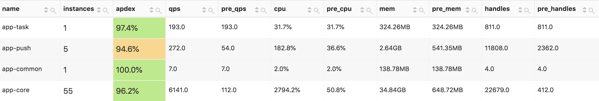

# 介绍

## 诞生
zenweb 框架诞生起因是为了解决大型 SAAS 项目而被设计开发，亦可用于单体项目。

## 设计
本项目开发完全使用 TypeScript 语言编写，设计为模块化可灵活组合，大型工程代码可维护为目的。

本项目中的所有模块都可以按需来组合，可以简化到只有一个 @zenweb/core 模块，也可以快速使用 zenweb 组合好的常用模块来快速开始。
从高效学习与使用的角度上来说，你只需要了解最基本的核心模块，其他模块根据你项目的需求来加载并使用。

## 高负载
借助于现代容器技术的发展，zenweb 从设计之初就没有考虑过自己实现多进程负载均衡等横向扩展技术。
而是被设计为单进程单实例最小化单位可运行为标准，通过 k8s 容器管理负载均衡横向扩展。
内置的 `@zenweb/metric` 健康指标收集模块，帮助运维监控系统健康指标。

@zenweb/metric:

## 站在巨人的肩膀上

zenweb 并不是从头开始的 web 框架，而是基于优秀的 [koa](https://koajs.com/)，需要了解更多细节可以访问 [koa 中文文档](https://koa.bootcss.com/)

选择已有已成熟的 koa 作为基础，是因为他有更多的生态，很多插件稍作封装即可拿来就用。

## 名称的由来

由 zen + web 两个单词的组合， zen 译为 “禅`chán`“ 为一种静思心境，开发项目亦如此，如果你的思绪混乱很难开发出一个可长久维护的好项目。
